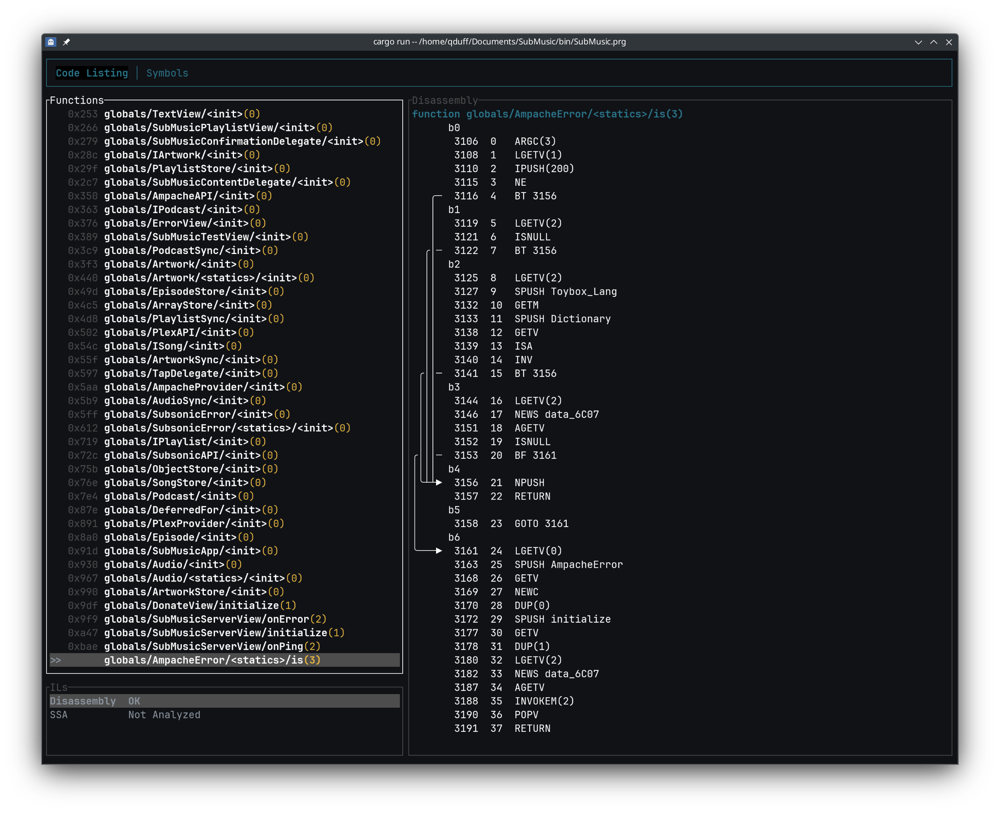

# mcdec

This project contains a collection of crates with the goal of making a decompiler for Garmin Monkey C programs.



## Components

The project is structured as a workspace with several crates:

*   **[prgparser](crates/prgparser/README.md):** A parser for the Garmin `.prg` format.
*   **[mcd](crates/mcd/README.md):** Provides the core disassembly and decompilation logic. It consumes a parsed `.prg` file from the `prgparser` crate.
*   **[tui](crates/tui/README.md):** A terminal user interface for visualizing and interacting with the decompiled output.

## Usage

The main user interface is the TUI. You can use the following command to run it:

```sh
cargo run --release -- <path/to/your.prg>
```

## License

This project is licensed under the Apache License 2.0. See the [LICENSE](LICENSE) file for details.

This tool is intended for educational and research purposes only. Users are responsible for ensuring they have the legal right to analyze any file they use with this software.
